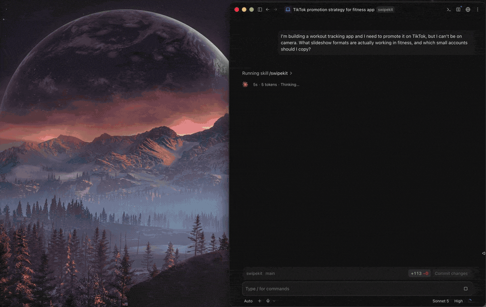

# swipekit

[](https://github.com/jorge-dev/swipekit/actions/workflows/ci.yml)
[](LICENSE)
[](#requirements)

Find the TikTok slideshow formats that actually work in your niche, with the numbers to back it up.



*One question, no tool names. It opens Chrome, measures what it finds, reads the winning slides, and comes back with the accounts worth copying — and the competitor already paying for placement.*

I shipped an app and then hit the part nobody warns you about. The code was the easy half. Figuring out how to get anyone to see it was the part I had no idea how to do, and scrolling TikTok for hours saving posts I never looked at again was not working.

So this scrolls TikTok for me. It measures every account it finds on real numbers, pulls the winning posts down slide by slide, and hands all of it to my coding agent so I can ask "what should I post next week" and get an answer I can actually check.

Everything runs on your machine. Your own Chrome, a local SQLite file, no account, no API key, no server. Nothing gets uploaded anywhere.

One thing to be upfront about: today this only analyzes slideshows, the swipeable photo carousels. It collects videos too but it does not yet tell you anything about them. See [Not there yet](#not-there-yet) for why and what it would take.

---

## What you actually get

Ask your agent something like "I have a looksmaxxing app, find me 5 accounts whose format I could copy, at least 100k views in the last 30 days" and you get a table like this:

| Account | Followers | Views (30d) | Slideshow % | Slides | Posts/wk | Spike |
|---|---|---|---|---|---|---|
| @hyginmaxxing | 9,466 | 4.0M | 100% | 6.5 | 4.2 | 197x |
| @glowuptips.ken | 3,597 | 4.6M | 100% | 6.8 | 9.1 | 62x |
| @stickhappened | 2,284 | 3.3M | 100% | 7.0 | 6.1 | 81x |

Then the part that matters. Which one is the blueprint and why, which one just got lucky once, what the slide by slide skeleton is, and what it would cost you to make it.

---

## What you can ask for

You never name a tool. Ask in plain English and the agent picks. These are the things people
actually want, and the sentence that gets each one.

**Is this niche worth it?**

> I'm building a puppy training app. Are TikTok slideshows worth it for this niche? I can't be on camera.

Searches the way the audience phrases things, measures what comes back, and answers on how
many *small* accounts are really winning. Tell it your constraints in the same breath, since
"I can't be on camera" changes which formats it recommends.

**Find me accounts to copy**

> Find me 5 accounts in this niche whose format I could actually copy. At least 100k views in the last 30 days, under 100k followers.

Any filter you say in words becomes a real filter: follower range, views in a window,
slideshow share, posts per week. It also drops accounts with one lucky viral post, and tells
you when it holds too few posts to be sure rather than quoting a confident wrong number.

**Why did this post work?**

> Read the top 5 posts and tell me why they worked, slide by slide.

It downloads the actual slides and looks at them, then names the hook, the structure, the
emotional angle, the CTA style, and what you'd need to produce it. That last part is the one
nobody else answers: whether it needs a camera, a real person, or just a design tool.

**Study these specific competitors**

> Scan @competitor1 and @competitor2 and compare them side by side.

Cadence, consistency, hit rate, best posts, whether their format is repeatable or a fluke.

**Plan my next 30 days**

> Now write me a playbook, then plan my next 30 days of posts.

The playbook is the recommendation. The plan turns it into dated posts, spread at the cadence
the winning accounts actually keep, each with a real topic and its slide-1 hook already
written. `swipekit plan` prints it back later, and it rides along in the report and export.

**Give me the file**

> Give me the report, and export it.

The report is a self-contained HTML page you can open or send. The export is markdown plus
the slide images, zipped, which Notion imports directly.

**Ask again later, for free**

> What do I already know about @someaccount?

Anything already collected answers instantly from the local library with no browsing. Ask
about the same account twice and the second time costs nothing.

**Get fresh numbers**

> Re-run this research with fresh data.

Searches are cached, so repeats are instant by default. Say "fresh" or "right now" and it
re-crawls instead of answering from the cache.

---

## Requirements

| | |
|---|---|
| Node.js 24+ | Runs TypeScript directly and uses the built in `node:sqlite`. No build step, no `tsc`. |
| Google Chrome | The real one, not Chromium. It uses your actual Chrome so the browser fingerprint is a real browser's. |
| A coding agent | Claude Code, Claude Desktop, Codex, or Cursor. Anything that speaks MCP. |
| macOS | Only for the HTML report, which uses `sips` to make thumbnails. Everything else works anywhere. |

No API key. The agent you are already talking to does the analysis, so this tool never buys its own inference. That is also why it works the same in Claude Code, Codex or Cursor.

---

## Install

If you just want to use it:

```bash
npm install -g github:jorge-dev/swipekit
```

That gives you two commands, `swipekit` and `swipekit-mcp`.

If you want to change it:

```bash
git clone git@github.com:jorge-dev/swipekit.git
cd swipekit
npm install
npm link
```

Either way you get a `swipekit` command on your PATH, and every command documents itself:

```bash
swipekit --help
swipekit accounts --help
```

A note on the build. Day to day the source runs directly, because Node 24 executes TypeScript with no build step. The one exception is installing: Node refuses to strip types under `node_modules`, so `npm install` compiles to `dist/` for you. You do not run that yourself and there is nothing to configure, but it is why `dist/` exists.

Then register the MCP server with your agent:

```bash
# Claude Code
claude mcp add swipekit -- swipekit-mcp

# Codex
codex mcp add swipekit -- swipekit-mcp
```

There are also two skills, which teach the agent how to read the numbers rather than just how to run the tools: `swipekit` (the research) and `swipekit-plan` (turning it into a dated schedule). Inside a clone they are already found, because the repo carries a copy for each agent — Claude Code's under `.claude/skills/`, Codex's (with an `agents/openai.yaml`) under `.agents/skills/`. To have them everywhere, copy both into your user skills directory:

```bash
# Claude Code
cp -r .claude/skills/swipekit .claude/skills/swipekit-plan ~/.claude/skills/

# Codex
cp -r .agents/skills/swipekit .agents/skills/swipekit-plan ~/.agents/skills/
```

### Just trying it, no install

You don't need `npm link` or a global command at all to point an agent at this. Get the source (clone it, or someone hands you a zip: `git archive --format=zip HEAD -o swipekit.zip`), install its dependencies, and register the MCP server straight at the source file:

```bash
cd swipekit
npm install
claude mcp add swipekit -- node --no-warnings "$PWD/src/mcp.ts"
```

Node 24 runs that TypeScript directly, no build step, so this works the moment `npm install` finishes. Use an absolute path (`$PWD` above expands to one) since the agent invokes that command from wherever it lives, not from inside the repo. The CLI works the same way without any linking: `node --no-warnings src/cli.ts stats`.

This is the whole tool with nothing skipped, just without a `swipekit` command sitting on your PATH afterward. Same goes for the CLI, see [Or use the CLI](#or-use-the-cli) below.

---

## Quickstart

Just talk to your agent. It picks the tools.

> I'm building a habit tracker app for students. Is TikTok slideshows a lane worth investing in for this, or am I better off elsewhere? Give me a straight answer.

It starts a scoped research run, searches TikTok the way the audience actually phrases things, measures what it finds, and comes back with a verdict based on how many small accounts are really winning in that niche. Sometimes the answer is no, and it will say so.

First run only: a Chrome window opens and TikTok will probably show you a slider captcha. Solve it yourself. The tool waits up to 4 minutes and then keeps going. That is the whole reason the browser is visible instead of headless, and it only happens once.

From there, [What you can ask for](#what-you-can-ask-for) is the phrasebook: accounts to copy, why a post worked, competitors side by side, and the next 30 days of posts.

### Or use the CLI

Everything the agent can do, you can do by hand:


```bash
swipekit runs --start "Habit trackers" --brief "productivity app for students"
swipekit discover "morning routine" "how to build habits" --target 120
swipekit accounts --min-views-30d 100000 --limit 10
swipekit scan someaccount
swipekit search "potty training"
swipekit seen @glowuptips.apex
```

`search` full-text searches everything already collected, instantly, no browsing. `seen` checks whether an account or topic has already been researched before you scrape it again. That's the "ask about it twice, run it once" part.

Run `swipekit` with no arguments to see every command.

No global install needed for any of this either. From inside a clone, after `npm install`, `node --no-warnings src/cli.ts` is the same command with the same flags:

```bash
node --no-warnings src/cli.ts discover "morning routine" "how to build habits" --target 120
node --no-warnings src/cli.ts accounts --min-views-30d 100000 --limit 10
```

Same parsing, same output, nothing on your PATH afterward. `npm link` only exists to save you typing that prefix every time.

---

## The report

Once you have collected some data there is a full HTML report. Just ask your agent for it:

> Give me the report for this run.

Or run it yourself:

```bash
swipekit report --posts 16
```

It writes a single self contained file to `library/reports/`, named after the run it covers — `2026-08-28-report-room-reset-tidysprint.html`. The path is printed when it finishes. Reports for different niches sit side by side rather than overwriting each other, so a library holding five questions can show you all five. Thumbnails are inlined, so you can open it anywhere or send it to someone without it breaking.

It reads as an argument rather than a dashboard. What to make first, then the patterns it rests on, then the proof, then the raw library underneath:

1. **What to make.** The playbook for your product, if your agent has written one. Named patterns, the evidence behind each, and slide skeletons already rewritten in your subject matter.
2. **Patterns behind it.** Hook types that more than one unrelated account landed on.
3. **The proof.** The posts themselves, with their slides shown at real 9:16, hook quoted, and a collapsible "how this slideshow is built" section.
4. **Accounts** and **shared sounds**, then every search that built the library.

Everything links out to TikTok. Accounts, posts, sounds, and the slide thumbnails themselves. A research report you cannot click through is useless, and the first version of this got that wrong.

### Getting it out of the report

The toolbar has **Copy** and **Export .md**. Copy is for pasting a section somewhere fast. Export downloads the whole plan as a markdown file.

Neither carries the slide images, and that is not a limitation I can fix in the browser. Relative paths break the moment the file moves, and base64 images are not rendered by most editors including Notion. For the images you want the bundle:

```bash
swipekit export
```

That writes a zip with the markdown and an `images/` folder beside it. In Notion, use Import, then Markdown & CSV, and pick the zip. Notion resolves the relative paths on the way in, so the slides come with it. Your agent can do the same thing if you ask it to export.

Useful flags:

```bash
swipekit report --run run_abc123      # scope it to one research question
swipekit report --posts 25            # more posts in the proof section
swipekit report --out ~/Desktop/x.html
```

Scope it to a run when you can. Unscoped it covers your whole library, so if you have researched two different niches the report will argue about one and show evidence from the other.

macOS only for now, because thumbnails go through `sips`. On other platforms it still writes the file, you just will not get the slide images.

---

## How it works

It does not call TikTok's API. Reverse engineering their request signing is where people lose weeks, and it breaks every few months anyway.

Instead it opens a real Chrome window, scrolls a real page, and listens to the responses TikTok's own JavaScript makes:

```ts
page.on("response", async (res) => {
  if (!FEEDS.some(f => res.url().includes(f))) return;
  const body = await res.json();
  for (const item of body.itemList ?? []) seen.set(item.id, item);
});
```

The page gives you the cookies, the signatures, the cursor handling and a real browser TLS fingerprint, because it really is the browser making the request. You just scroll and read what comes back.

It paces itself like a person. Jittered scroll amounts, one page, one browser, 4 to 11 seconds between surfaces, roughly 40 to 90 posts a minute. Do not try to parallelise it.

---

## The numbers that matter

Most of the value here is in not getting fooled by view counts.

**Views per follower, not views.** A 2M follower account with a 400k view post tells you about its audience. An 8k follower account with a 300k view post tells you about the format, and the format is the only thing that transfers to you.

**Spike is best divided by median views.** This is how you tell a system from a lottery ticket. A big spike across a few posts is one lucky hit. A spike near 1 with high posts per week is a machine that clears the bar over and over. Both are useful, they just teach opposite things.

**Never copy a one hit profile.** An account only gets marked `repeatable` if it cleared the bar at least three times, with one of those in the last 90 days.

**Saves are the win condition.** A save means "I'll come back to this", which is the intent that turns into an install. Normal is 1 to 2 percent. 6 to 9 percent is as good as it gets. For a utility app a high save, low view post beats the other way around.

**Distinct accounts is not distinct operators.** One person running twenty accounts posting the same caption is a normal playbook. `track_sound` clusters on captions and reports `independentAccounts`, so a cohort that looks 60 wide can turn out to be five people.

---

## Two ways to drive it

**Your agent.** 26 MCP tools. You never call them by name, you ask a question and the agent picks. Roughly it goes `start_run`, `product_profile`, `discover`, `find_accounts`, `scan_account`, `read_slides`, `write_playbook`.

`read_slides` hands the actual slide images to your agent to look at. There is no model inside that tool. You are the analyst, which is why there is no API key anywhere in this.

**The CLI.** Same capabilities, no agent needed. Good for scripting and for seeing exactly what the agent sees.

---

## Transports

**stdio is the default, and it is the one you want.** Your agent starts the server itself and it exits when your agent does, so there is nothing to run first and nothing left behind. Open ten sessions and you get ten short-lived server processes — that is how every stdio MCP server works — but still **one Chrome and one library**, because the second process finds the first one's browser and attaches to it rather than fighting it for the profile lock. If it can't get in within 20 seconds it fails with a real message instead of hanging, and if the session that owns Chrome goes away, the next one opens a fresh one.

Each of those processes opens the same SQLite file. That is fine: reads happen side by side, and a write that collides waits its turn instead of failing.

**HTTP is for one specific case:** several agents working at once that should share a *warm cache* rather than each keeping their own. It is one process, so one SQLite handle and one set of cached searches for everybody.

```bash
MCP_HTTP=1 MCP_PORT=8934 swipekit-mcp &
claude mcp add --transport http swipekit http://127.0.0.1:8934/mcp
codex mcp add swipekit --url http://127.0.0.1:8934/mcp
```

The trade is that you now own a background process: you start it, and you restart it after a reboot or an upgrade. Forget to, and every tool call fails with a connection error. That is the main reason it isn't the default.

It binds to 127.0.0.1 and checks the `Origin` header on every request. Both matter. Binding to localhost alone does not keep a web page out — DNS rebinding points an attacker's domain at 127.0.0.1, the browser then treats this port as same-origin, and CORS never enters into it. The `Origin` header still carries the page's real origin, so that is the check that actually holds. Requests without an `Origin` are accepted, because a real MCP client is not a browser and doesn't send one.

---

## Where your data lives

Everything lives in one directory, picked in this order:

1. `$SWIPEKIT_HOME`, if you set it. Use this to keep separate libraries apart, or to point the global command at a library inside a checkout.
2. `./library`, if that directory already exists where you are standing. This is what you get inside a clone of the repo.
3. `~/.swipekit/library`, the default once you have run `npm link`.

That third rule is the one that matters after a global install. Without it, running the command from your Desktop would quietly start a brand new empty library there instead of finding the one you have been filling up.

| Path | What |
|---|---|
| `swipekit.db` | Every post, account, run and analysis. Plain SQLite, open it with anything. |
| `posts/<id>/` | Downloaded slides plus `metadata.json` |
| `zips/` | Zipped posts from `download_post` |
| `products/*.md` | Your product profiles. Plain markdown, edit them by hand. |
| `reports/` | Generated reports and plans, one file per run: `<date>-report-<run>.html` |
| `~/.swipekit/chrome-profile` | The persistent Chrome profile (cookies, solved captcha) |

`library/` is gitignored. It is yours and it never leaves the machine.

To start over completely (a fresh library, a fresh Chrome profile, first-run captcha and all): `npm run reset` from inside a clone, or `node --no-warnings src/dev/reset.ts` if you're running from source with no install.

---

## Responsible use

Read this part, it is short and it matters.

It never logs in. Everything works logged out and it stays that way on purpose. Courts have treated scraping public, logged out data very differently from anything behind an account (hiQ v. LinkedIn, and Meta v. Bright Data in 2024). Logging in would move this from public data to breaking that account's terms. Please do not add a login.

Rate limit yourself. The pacing in here is deliberate. Turning it up is how you get blocked, and how you become a problem for a service you do not own.

The slides you download are someone else's copyrighted work. Use them to understand structure. Do not republish them and do not ship a near copy. Take the skeleton and write your own words and art.

TikTok's terms forbid scraping. This is a contract risk you are choosing to take on a personal research tool. Know that going in.

Do not resell it or run it at scale. That is where tools like this attract real legal attention.

---

## Troubleshooting

**A captcha appeared.** Solve it in the Chrome window, it waits and resumes. Once per profile.

**"No posts harvested".** A blocked response is an HTTP 200 with an empty body, which looks exactly like an empty feed. Usually a captcha or a soft block. Check the Chrome window.

**Nothing from a hashtag.** Expected. Hashtag feeds return a video heavy slice and some return no slideshows at all. Use search queries.

**"slide URLs expired".** Slide images carry a 48 hour signature. It re-scans and retries automatically now, but if it still fails run `scan_account` on that handle.

**Empty responses everywhere.** You are soft blocked. Stop for the day. Retrying turns a soft block into a hard one.

**Two clients fighting over Chrome.** Shouldn't happen anymore, the second one attaches to the first's browser instead of trying to open its own. If you still see it hang, something else has port 9423 (set `SWIPEKIT_CDP_PORT` to move it), or a stuck Chrome process needs killing: `pkill -f "user-data-dir=$HOME/.swipekit/chrome-profile"`.

---

## Not there yet

Honest list of what this does not do, so you know what you are picking up.

### Videos

Slideshows are the only format this can tell you anything about. That is a real limit, not a temporary one, and it splits into two very different pieces of work.

**The crawler already handles video.** Nothing in the collection path checks the format before saving. My own library has 673 video posts in it right now with complete stats, and the top one has 57.4M views. Views, saves, followers, sound, caption, hashtags and timestamps all get captured exactly the same way.

**The analysis throws them out.** There are 25 hardcoded `is_photo = 1` filters across 7 files. Lifting those is mostly mechanical, a format argument threaded through instead of a constant, because every metric here is already blind to format. Views per follower, spike, `repeatable`, cadence, caption clustering and sound cohorts do not know or care what the post looks like.

**Reading a video is the hard part.** `read_slides` works because a slideshow is its own evidence. TikTok hands over the image URLs in the same payload as the stats, so the tool does a plain GET per slide and your agent looks at them. Video has no equivalent. You would need to pull the file down a signed and rate limited path, sample frames, and even then frames are the wrong evidence, because a video hook is usually spoken in the first two seconds and never appears on screen. Transcripts would be the thing worth having. TikTok does ship auto generated captions in the item payload and that may be a cheap way in, but I have not tested it, so treat it as a lead and not a plan.

Until that part is solved, the pattern extraction and the playbooks stay slideshow only.

### Other platforms

TikTok only. Instagram is the obvious next one and most of this would survive the move, since the crawler is the only piece that is really TikTok specific.

### Smaller things

- Nothing runs on a schedule. You rerun it when you want fresh numbers.
- Chrome has to be visible, because that is how you solve the captcha when one shows up.

---

## Contributing

Ideas, bugs and PRs welcome, see [CONTRIBUTING.md](CONTRIBUTING.md). The most useful thing right now would be another platform. Instagram is the obvious next one and the crawler is the only part that is really TikTok specific.

By taking part you agree to the [Code of Conduct](CODE_OF_CONDUCT.md). Security issues go to [SECURITY.md](SECURITY.md) rather than a public issue, and released changes are listed in [CHANGELOG.md](CHANGELOG.md).

## License

[MIT](LICENSE).
